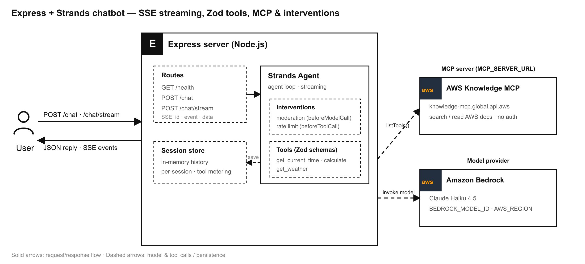

# Express chatbot with SSE streaming, Zod tools and MCP

A Node.js + Express chatbot service built on the Strands Agents TypeScript SDK. It exposes a streaming chat API over Server-Sent Events (SSE), defines its tools with Zod, keeps per-session conversation history, loads extra tools from a remote MCP server (the public AWS Knowledge MCP Server by default), and applies interventions for rate limiting and content moderation.

## Overview

| Information            | Details                                                                 |
|------------------------|-------------------------------------------------------------------------|
| **Agent Architecture** | Single-agent                                                            |
| **Native Tools**       | None                                                                    |
| **Custom Tools**       | `get_current_time`, `calculate`, `get_weather` (Zod input schemas)      |
| **MCP Servers**        | [AWS Knowledge MCP Server](https://knowledge-mcp.global.api.aws) (default; public, no auth) — configurable via `MCP_SERVER_URL` |
| **Use Case Vertical**  | General-purpose / developer starter                                     |
| **Complexity**         | Intermediate                                                            |
| **Model Provider**     | Amazon Bedrock                                                          |
| **SDK Used**           | Strands Agents TypeScript SDK                                           |

### Architecture



The user talks to an Express server that runs a Strands Agent per turn. The agent applies a moderation intervention before each model call and a rate-limit intervention before each tool call, calls the local Zod tools (plus the tools loaded from a remote MCP server at startup), and invokes Amazon Bedrock for inference. By default the MCP client connects to the public **AWS Knowledge MCP Server**, so the agent can search and read up-to-date AWS documentation. Conversation history is persisted per session and replayed on the next turn. Responses are returned as JSON (`/chat`) or streamed as Server-Sent Events (`/chat/stream`).

### Key Features

- **SSE streaming with event ids** — `POST /chat/stream` forwards every agent event as its own SSE message with an incrementing `id:` line, so clients can track position and reconnect with `Last-Event-ID`.
- **Zod tools** — three custom tools whose inputs are validated by Zod schemas before the callback runs.
- **Session store** — an in-memory store keeps per-session conversation history, replayed into the agent on every turn so the chatbot is stateful.
- **MCP client** — connects to a remote MCP server at startup and loads its tools alongside the local ones. Defaults to the public [AWS Knowledge MCP Server](https://knowledge-mcp.global.api.aws) (no credentials required), which exposes tools to search and read official AWS documentation.
- **Interventions** — a rate-limit intervention caps tool calls per session, and a moderation intervention blocks configured terms before the model is called.

## Prerequisites

- Node.js **18.x** or later
- AWS account with [Amazon Bedrock model access](https://docs.aws.amazon.com/bedrock/latest/userguide/model-access-modify.html) for the configured model (default: `us.anthropic.claude-haiku-4-5-20251001-v1:0`)
- AWS credentials available via the default credential chain (environment variables, shared config/credentials file, SSO, or an IAM role)

## Setup

1. **Configure environment variables:**
   ```bash
   cd typescript/01-learn/07-express-chatbot
   cp .env.example .env
   # Edit .env with your AWS region, model id, and optional MCP/rate-limit/moderation settings
   ```

2. **Install dependencies:**
   ```bash
   npm install
   ```

## Usage

**Start the server (development, auto-reload):**
```bash
npm run dev
```

**Or build and run:**
```bash
npm run build
npm start
```

The server listens on `http://localhost:3000` (configurable via `PORT`).

### Endpoints

| Method & Path       | Description                                              |
|---------------------|----------------------------------------------------------|
| `GET /health`       | Liveness check and live session count                    |
| `POST /chat`        | Non-streaming turn; returns the final reply as JSON      |
| `POST /chat/stream` | Streaming turn over Server-Sent Events                   |

Both chat endpoints accept a JSON body `{ "message": string, "sessionId"?: string }`. Omit `sessionId` on the first turn — the response returns a new session id you can reuse to continue the conversation.

**Non-streaming request:**
```bash
curl -X POST http://localhost:3000/chat \
  -H 'Content-Type: application/json' \
  -d '{"message": "What time is it in Tokyo?"}'
```

**Streaming request (SSE):**
```bash
curl -N -X POST http://localhost:3000/chat/stream \
  -H 'Content-Type: application/json' \
  -d '{"message": "What is 21 * 2, and what is the weather at 48.85,2.35?"}'
```

Each SSE message looks like:
```
id: 3
event: contentBlockEvent
data: {"type":"contentBlockEvent","contentBlock":{ ... }}
```
The first event is always a `session` event carrying the `sessionId`, and the stream ends with a `done` event (or an `error` event if the turn failed).

## Example Queries

- "What time is it in `America/New_York`?"
- "Calculate 128 divided by 4."
- "What's the current weather at latitude 51.5, longitude -0.12?"
- "Search the AWS docs for how Amazon Bedrock model access works." *(uses the AWS Knowledge MCP tools)*

## Project Structure

| Component            | File(s)                                      | Description                                             |
|----------------------|----------------------------------------------|---------------------------------------------------------|
| Configuration        | `src/config.ts`                              | Reads settings from environment variables               |
| Custom tools         | `src/tools/chatTools.ts`                     | Three Zod-validated tools                               |
| Session store        | `src/sessions/SessionStore.ts`               | In-memory per-session history and rate-limit metadata   |
| MCP client           | `src/mcp/mcpTools.ts`                         | Optional MCP connection and tool loading                |
| Rate-limit policy    | `src/interventions/RateLimitIntervention.ts` | Caps tool calls per session per time window             |
| Moderation policy    | `src/interventions/ModerationIntervention.ts`| Blocks configured terms before the model call           |
| Agent factory        | `src/agent.ts`                               | Builds a per-turn agent seeded with session history     |
| HTTP server          | `src/server.ts`                              | Express app with `/health`, `/chat`, `/chat/stream`     |
| Entry point          | `src/index.ts`                               | Loads env, connects MCP, starts the server              |

## Configuration

| Variable                    | Default                                          | Description                                        |
|-----------------------------|--------------------------------------------------|----------------------------------------------------|
| `PORT`                      | `3000`                                           | HTTP port                                          |
| `AWS_REGION`                | `us-east-1`                                      | Region for the Bedrock model                       |
| `BEDROCK_MODEL_ID`          | `us.anthropic.claude-haiku-4-5-20251001-v1:0`    | Bedrock model id                                   |
| `MCP_SERVER_URL`            | `https://knowledge-mcp.global.api.aws`           | Streamable HTTP MCP server URL. Defaults to the AWS Knowledge MCP Server; set to empty to disable MCP |
| `RATE_LIMIT_MAX_TOOL_CALLS` | `10`                                             | Max tool calls per session within the window       |
| `RATE_LIMIT_WINDOW_MS`      | `60000`                                          | Rate-limit window in milliseconds                  |
| `MODERATION_BLOCKED_TERMS`  | *(empty)*                                        | Comma-separated blocked terms (case-insensitive)   |

## Testing

A smoke test verifies the pieces that do not require Bedrock credentials (tool registration, moderation, rate limiting, and the HTTP layer):

```bash
npm run smoke
```

Type-check the project:

```bash
npm run typecheck
```

## Troubleshooting

| Symptom                                   | Likely Cause                              | Fix                                                                 |
|-------------------------------------------|-------------------------------------------|---------------------------------------------------------------------|
| Stream emits an `error` event immediately | Missing/invalid AWS credentials           | Configure AWS credentials and Bedrock model access                  |
| `AccessDeniedException` from Bedrock      | Model access not enabled for your account | Enable access for the model id in the Bedrock console               |
| MCP tools not loaded                      | `MCP_SERVER_URL` unset or unreachable     | Set a reachable Streamable HTTP MCP server URL in `.env`            |
| `429`-style refusal in replies            | Rate limit reached for the session        | Raise `RATE_LIMIT_MAX_TOOL_CALLS` or widen `RATE_LIMIT_WINDOW_MS`   |

## Additional Resources

- [Strands Agents Documentation](https://strandsagents.com/)
- [TypeScript API Reference](https://strandsagents.com/latest/documentation/docs/api-reference/typescript/agent/agent/)
- [Model Context Protocol](https://modelcontextprotocol.io/)
- [AWS Knowledge MCP Server](https://knowledge-mcp.global.api.aws)
- [Server-Sent Events (MDN)](https://developer.mozilla.org/en-US/docs/Web/API/Server-sent_events)

## Disclaimer

This sample is provided for educational and demonstration purposes only. It is not intended for production use without further development, testing, and hardening. The moderation intervention uses simple substring matching for illustration — replace it with a real moderation service before relying on it. For production, back the session store with a shared store and add appropriate authentication, input validation, and observability.
