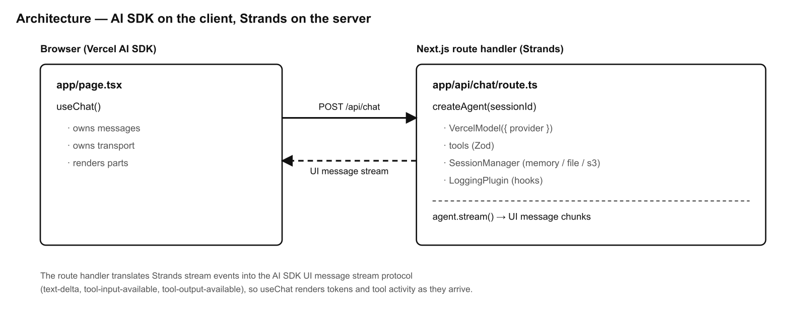
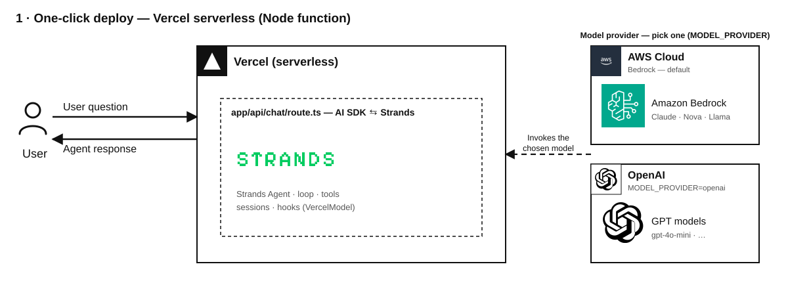
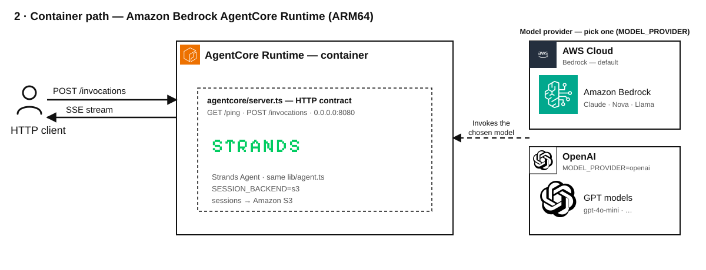
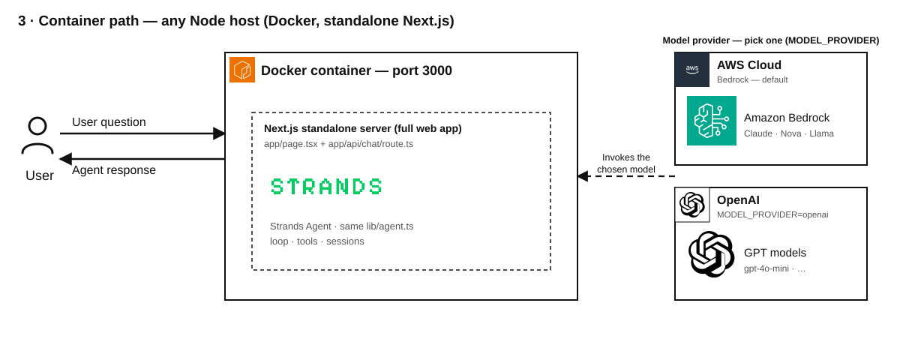

# Strands × Vercel AI SDK — Next.js Template

A `create-next-app`-shaped chat sample where the **Vercel AI SDK owns the client and the providers**, and **[Strands Agents](https://strandsagents.com) runs the loop, tools, sessions, and hooks** inside the Next.js route handler through the **`VercelModel` adapter**. One-click deploy to Vercel, plus a container path to Amazon Bedrock AgentCore.

## Overview

### Sample Details

| Information            | Details                                                                 |
|------------------------|-------------------------------------------------------------------------|
| **Agent Architecture** | Single-agent                                                            |
| **Native Tools**       | `calculator`, `current_time`                                            |
| **Custom Tools**       | None (Zod-typed tools defined inline in `lib/tools.ts`)                 |
| **MCP Servers**        | None                                                                    |
| **Use Case Vertical**  | Developer tooling / Conversational AI                                   |
| **Complexity**         | Intermediate                                                            |
| **Model Provider**     | Amazon Bedrock (default) or OpenAI                                      |
| **SDK Used**           | Strands Agents SDK (TypeScript) + Vercel AI SDK                         |

### Architecture



The route handler translates Strands stream events into the AI SDK UI message
stream protocol (`text-delta`, `tool-input-available`, `tool-output-available`),
so `useChat` renders tokens and tool activity as they arrive.

### Key Features

- **AI SDK on the client** — `useChat` from `@ai-sdk/react` manages the conversation and streaming UI.
- **Strands on the server** — the agent loop, Zod-typed tools, session persistence, and lifecycle hooks run in `app/api/chat/route.ts`.
- **`VercelModel` adapter** — Strands wraps any Vercel AI SDK provider (`@ai-sdk/amazon-bedrock`, `@ai-sdk/openai`, …). Switch providers with one env var, no code changes.
- **One-click deploy to Vercel** — ships as a serverless Node function.
- **Container path to Amazon Bedrock AgentCore** — the same agent, served over the AgentCore HTTP contract (`/ping` + `/invocations`) on an ARM64 container.

## Prerequisites

- Node.js **18+**
- One model provider configured:
  - **Amazon Bedrock** (default): AWS credentials and [model access](https://docs.aws.amazon.com/bedrock/latest/userguide/model-access-modify.html) enabled for the configured model, **or**
  - **OpenAI**: an `OPENAI_API_KEY`.
- (Optional) Docker, for the AgentCore / Node host container paths.

## Setup

1. **Configure environment variables:**
   ```bash
   cp .env.example .env.local
   # then fill in credentials (see Configuration below)
   ```

2. **Install dependencies:**
   ```bash
   npm install
   ```

## Usage

**Run the dev server:**
```bash
npm run dev
```

Open http://localhost:3000. Try:

- *"what is 128 divided by 4?"* → calls the `calculator` tool
- *"what time is it in America/Mexico_City?"* → calls the `current_time` tool

## Configuration

All configuration is via environment variables — see [`.env.example`](./.env.example).

### Model provider (the AI SDK owns the provider; Strands wraps it)

| Variable | Default | Description |
|---|---|---|
| `MODEL_PROVIDER` | `bedrock` | `bedrock` or `openai`. |
| `AWS_REGION` | `us-east-1` | Region for Amazon Bedrock. |
| `AWS_ACCESS_KEY_ID` / `AWS_SECRET_ACCESS_KEY` | — | AWS credentials (Bedrock). |
| `BEDROCK_MODEL_ID` | `us.anthropic.claude-sonnet-4-20250514-v1:0` | Bedrock model id. |
| `OPENAI_API_KEY` | — | Required when `MODEL_PROVIDER=openai`. |
| `OPENAI_MODEL_ID` | `gpt-4o-mini` | OpenAI model id. |

To switch to OpenAI, set `MODEL_PROVIDER=openai` and `OPENAI_API_KEY` — no code changes.

### Sessions (Strands persists conversation state)

| Variable | Default | Description |
|---|---|---|
| `SESSION_BACKEND` | `memory` | `memory`, `file`, or `s3`. |
| `SESSION_DIR` | `./.sessions` | Directory for the `file` backend. |
| `SESSION_S3_BUCKET` | — | Bucket for the `s3` backend. |
| `SESSION_S3_PREFIX` | `sessions/` | Key prefix for the `s3` backend. |

## Deploy to Vercel



[](https://vercel.com/new/clone?repository-url=https%3A%2F%2Fgithub.com%2Fstrands-agents%2Fsamples%2Ftree%2Fmain%2Ftypescript%2F02-deploy%2F02-nextjs-vercel-adapter&project-name=strands-nextjs-vercel-adapter&repository-name=strands-nextjs-vercel-adapter&env=MODEL_PROVIDER,AWS_REGION,AWS_ACCESS_KEY_ID,AWS_SECRET_ACCESS_KEY&envDescription=Model%20provider%20and%20credentials.%20See%20.env.example.&envLink=https%3A%2F%2Fgithub.com%2Fstrands-agents%2Fsamples%2Fblob%2Fmain%2Ftypescript%2F02-deploy%2F02-nextjs-vercel-adapter%2F.env.example)

The `/api/chat` route runs on the Node.js runtime. Set your provider env vars in
the Vercel dashboard (see Configuration). For persistence across serverless
instances, use `SESSION_BACKEND=s3`.

## Container path → Amazon Bedrock AgentCore

The same Strands agent (`lib/agent.ts`) is also served over the AgentCore HTTP
contract: `GET /ping` and `POST /invocations` (SSE streaming) on `0.0.0.0:8080`,
ARM64.



```bash
# Run the AgentCore runtime locally
npm run agentcore
curl localhost:8080/ping
curl -N -X POST localhost:8080/invocations \
  -H 'content-type: application/json' \
  -d '{"prompt":"what is 21 * 2?","sessionId":"demo"}'

# Build the ARM64 image for AgentCore
docker build --platform linux/arm64 -f agentcore/Dockerfile -t strands-agentcore .
```

Push the image to Amazon ECR and create an AgentCore Runtime pointing at it. Use
`SESSION_BACKEND=s3` so conversation state survives across instances. See the
[AgentCore HTTP protocol contract](https://docs.aws.amazon.com/bedrock-agentcore/latest/devguide/runtime-http-protocol-contract.html).

## Container path → any Node host

A production `Dockerfile` (standalone Next.js output) is included for running the
full web app anywhere:



```bash
docker build -t strands-nextjs .
docker run -p 3000:3000 --env-file .env.local strands-nextjs
```

## Project Structure

| Component | File(s) | Description |
|---|---|---|
| Chat UI | `app/page.tsx` | Client chat UI (`useChat`). |
| API route | `app/api/chat/route.ts` | Strands loop bridged to the AI SDK UI stream. |
| Model | `lib/model.ts` | Provider selection → `VercelModel`. |
| Tools | `lib/tools.ts` | Zod-typed tools. |
| Hooks | `lib/hooks.ts` | `LoggingPlugin` — lifecycle hooks. |
| Sessions | `lib/session.ts` | Pluggable session storage. |
| Agent | `lib/agent.ts` | Assembles the `Agent`. |
| AgentCore | `agentcore/` | Container path to Amazon Bedrock AgentCore. |

## Additional Resources

- [Strands Agents](https://strandsagents.com) · [`VercelModel` adapter](https://github.com/strands-agents/harness-sdk/blob/main/strands-ts/src/models/vercel.ts)
- [Vercel AI SDK](https://ai-sdk.dev) · [`useChat`](https://ai-sdk.dev/docs/reference/ai-sdk-ui/use-chat)
- [Amazon Bedrock AgentCore](https://docs.aws.amazon.com/bedrock-agentcore/)

---

## Disclaimer

This sample is provided for educational and demonstration purposes only. It is not intended for production use without further development, testing, and hardening.

For production deployments, consider:
- Implementing appropriate content filtering and safety measures
- Following security best practices for your deployment environment
- Conducting thorough testing and validation
- Reviewing and adjusting configurations for your specific requirements
